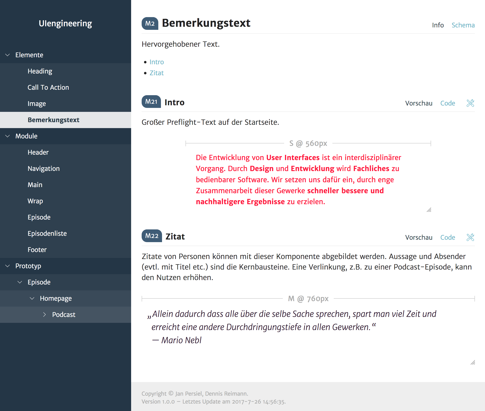
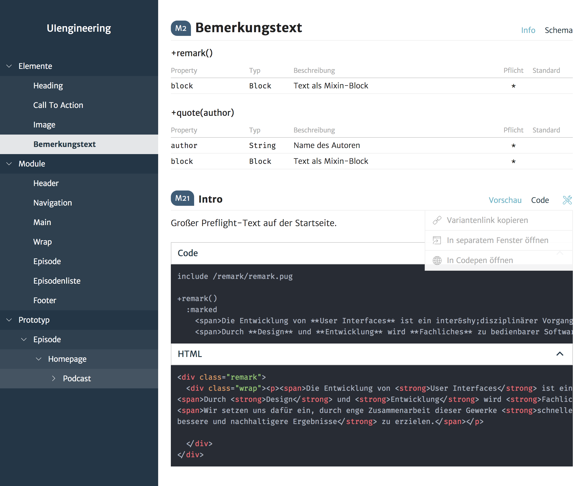
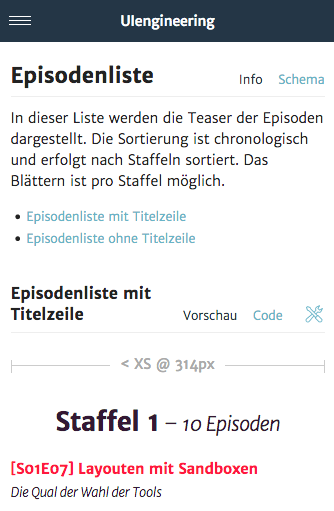

# UIengine

The UIengine is a tool *for developers, designers and product owners* to *create, document and evolve a design system* collaboratively.
It generates your *design system documentation* (i.e. pattern library, styleguide or brand manual) and brings *the tools to implement the design system* in your web site or application.

## 🚀  What it enables

- Establishes a *component driven workflow* and structures your web UI into modular patterns/components.
- Gives your team and stakeholders a central spot to *develop and document* the UI of the web site/application.
- Produces production ready code from day one and *aims to replace most deliverables* with usable and testable output.
- *Makes documentation fun and easy* by providing the tools to create and structure the docs in a way that fits your project.

## ☝️ Disclaimer

This project is currently under active development.
Some of the concepts and APIs are subject to change. 

Please do not to rely on it for production use until we provide a stable v1.0 release (see the [roadmap](https://github.com/dennisreimann/uiengine/milestones) for details).
Nevertheless we encourage you to try it out and provide feedback.

## 🖥 Examples and Screenshots

To get an idea of what the basics look like, take a glimpse at the 
[deployed sample project](http://uiengine-sample-project.uix.space/)
and the
[sample project source code](./packages/test-project).
There is also an
[introduction video](https://www.youtube.com/watch?v=OKHAhIQLvjU).

### Component documentation and preview

### Component schema, code view and options

### Mobile UI

## 🔩 Technical TL;DR

At its core, the UIengine is a static site generator.
It consumes the data by parsing the files and structure of your project and generates the documentation site based on this data.
In development mode the output is regenerated on file change and synced to the browser, giving you a comfortable experience creating the components and docs.

- **Template agnostic**: Various templating engines are integrated via the concept of adapters, giving you flexibility of choice and the option to integrate custom ones. It works best with whatever can be rendered via JavaScript, which includes popular solutions like JSX, Pug/Jade, Handlebars, etc.
- **Best practice approach**: The tool guides you towards best practices like not using application logic in the view layer (i.e. having crazy amounts of helpers or global variables) by proposing a separation of data and template.
- **In sync with the end product**: Since the docs are generated from the code that will be used in your application, you get a living pattern library – not a thing that needs to be looked after as a separate task.
- **Covers green- and brownfield projects**: Whether you start out with a pattern library or want to transition your process and refactor your existing UI into modular components, the UIengine has you covered.
- **Flexible integrations**: Templating engines and the theme can be configured or completely swapped out so you can fit it to your needs. Same goes for the markdown parsing/rendering which is configurable too.

For the evaluation process you might also want to have a look at the [alternatives](#-alternatives).

### 🗜 Prerequisites

UIengine requires at least Node.js 6.9. Future versions will track the latest active Node.js LTS version, which guarantees a reasonable level of backwards compatibility.

## 📘 Documentation

How To and Quick Start:

- [Getting Started](./docs/getting-started.md)
- [Integrations](./docs/integrations.md)

Technical documentation, with more detailed information:

- [Configuration](./docs/config.md)
- [Adapters](./docs/adapters.md)
- [Component](./docs/component.md)
- [Variant](./docs/variant.md)
- [Entities/Properties](./docs/entities-properties.md)
- [Theme](./docs/theme.md)
- [YAML](./docs/yaml.md)
- [Deployment](./docs/deployment.md)

## 🛠 Development

You like this project and are interested in participating?
See the [development docs](./docs/development.md) for an introduction and workflows when hacking on the UIengine.

### 👩‍💻👨‍🎨  The Vision: An Interface Exchange for everyone involved in UI 👩‍🔬👨‍💼

The terms *pattern library* or *styleguide* suggest an association with a particular craft that affects the UI.
Pattern libraries are understood as a tool that is primarily used by developers, whereas styleguides are associated with the creative output of the designers.
In contrast to that, the term *Interface Exchange* describes a place where everyone involved in the UI comes together:
Concept and user experience, product owners, as well as designers and developers.

And even though the UIengine is not completely there yet, we strive to evolve it into a tool that fits the needs of all crafts.

## 💁 Individual packages

- 🚀 [UIengine core](./packages/uiengine)
- 🎨 [UIengine default theme](./packages/uiengine-theme-default)
- 🔌 [Pug templating adapter](./packages/uiengine-adapter-pug)
- 🔌 [React/JSX templating adapter](./packages/uiengine-adapter-react)
- 🔌 [Vue templating adapter](./packages/uiengine-adapter-vue)
- 🔌 [Marko templating adapter](./packages/uiengine-adapter-marko)
- 🔌 [Handlebars templating adapter](./packages/uiengine-adapter-handlebars)
- 🔌 [EJS templating adapter](./packages/uiengine-adapter-ejs)
- 🔌 [HTML templating adapter](./packages/uiengine-adapter-html)

### 🖖 Alternatives

OK, the UIengine looks really cool but it's not quite what you are looking for?
Or you want to first compare a few solutions to see which one is the right fit?
Here are some other projects that you might want to evaluate:

- [Pattern Lab](http://patternlab.io/)
- [Fractal](http://fractal.build/)
- [patternplate](https://github.com/sinnerschrader/patternplate/)

… or have a look at [the ever growing list of similar tools](https://github.com/davidhund/styleguide-generators).

- - - - -

👨🏻‍💻 Brought to you by the nice people behind [UIengineering](https://www.uiengineering.de). 👨🏻‍💻
